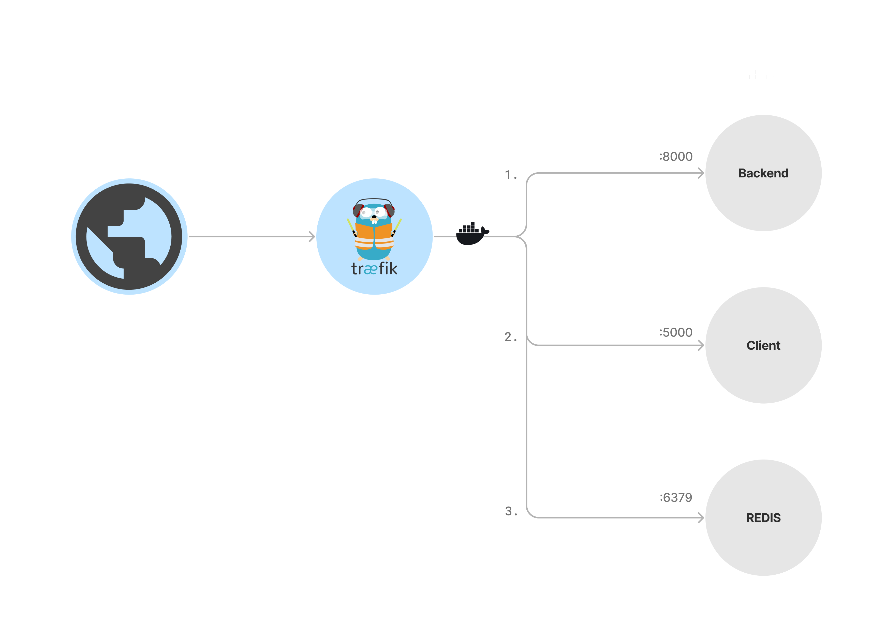

# Deno blog scraper

```bash
docker network create web
```

```bash
docker-compose up -d
```

## Architecture




## Backend

[Read guide](/backend/README.md)

## Client

[Read guide](/client/README.md)

## Redis

[Read guide](/redis/README.md)
